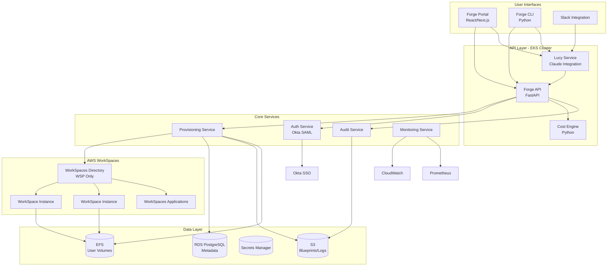
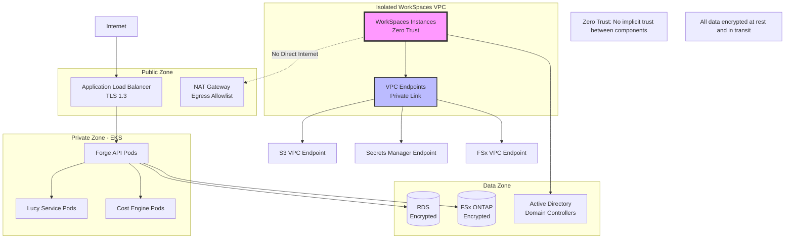
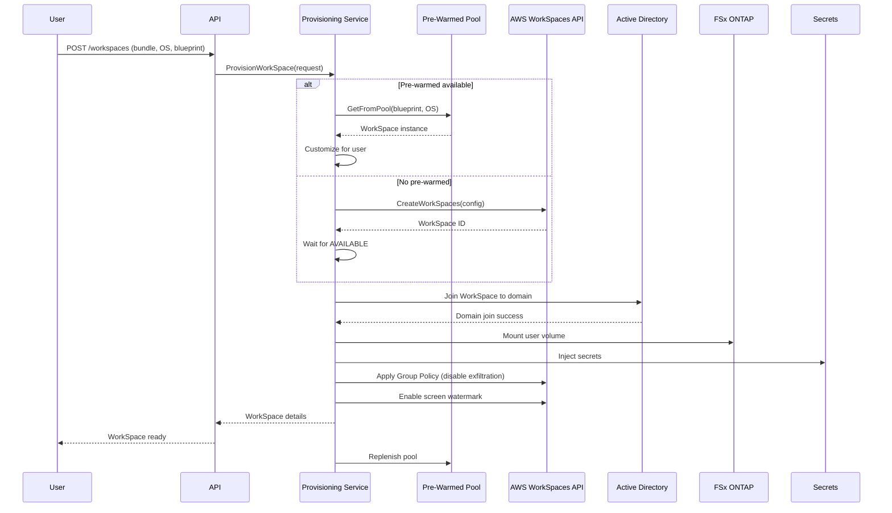
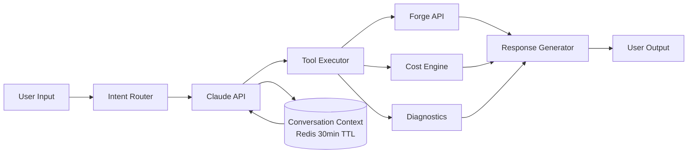

# Design Document: RobCo Forge

## Overview

RobCo Forge is a self-service cloud engineering workstation platform built on AWS WorkSpaces Personal and WorkSpaces Applications. The platform provides engineers with secure, high-performance development environments accessible through three interfaces: a web portal, a CLI tool, and Lucy (an AI chatbot powered by Anthropic Claude).

The architecture emphasizes security-first design with zero data exfiltration, global performance through region-aware provisioning, and comprehensive cost governance. All WorkSpaces use WSP (WorkSpaces Streaming Protocol) exclusively, with PCoIP disabled at every level.

### Key Design Principles

1. **Security by Default**: All data exfiltration vectors disabled via WSP Group Policy, network isolation, and screen watermarking
2. **Multi-Interface Consistency**: Identical capabilities and enforcement across web portal, CLI, and Lucy chatbot
3. **Cost Transparency**: Real-time cost visibility with proactive warnings and hard budget enforcement
4. **Developer Experience**: Sub-5-minute provisioning, pre-warmed pools, persistent user volumes, and conversational AI assistance
5. **Global Performance**: Region-aware provisioning and WSP streaming optimized for low latency

## Architecture

### High-Level Architecture



### Network Architecture


```

### Technology Stack

**Frontend**
- React 18 with TypeScript (strict mode enabled)
- Next.js 14 (App Router)
- TanStack Query for data fetching
- Tailwind CSS for styling
- WebSocket for real-time updates

**CLI**
- TypeScript (strict mode enabled)
- Node.js runtime
- Commander.js for CLI framework
- Axios for API client

**Backend**
- Python 3.11+ with type hints (enforced via mypy)
- FastAPI for REST API with OpenAPI documentation
- SQLAlchemy for ORM
- Celery for async task processing
- Redis for caching and task queue

**AI/ML**
- Anthropic Claude 3 (via AWS Bedrock or direct API)
- LangChain for tool-augmented architecture
- Prompt caching for cost optimization

**Infrastructure**
- AWS EKS (Kubernetes 1.28+)
- Terraform for AWS resources
- AWS CDK for Kubernetes manifests
- Helm for application deployment

**Data Storage**
- RDS PostgreSQL 15 (metadata, audit logs)
- Amazon FSx for NetApp ONTAP (user volumes, persistent storage)
- Amazon S3 (blueprints, backups, long-term logs)

**Observability**
- CloudWatch (AWS service metrics, logs)
- Prometheus (custom metrics)
- Grafana (dashboards)
- OpenTelemetry (distributed tracing)
- Structured logging (JSON format) for all services

**Authentication**
- Okta (SSO provider)
- SAML 2.0 protocol
- JWT tokens for API authentication

## Components and Interfaces

### UX Design Themes

RobCo Forge will support two visual themes to match different user preferences and the RobCo Industries brand identity:

**1. Modern Professional Theme** (Default)
- Clean, minimal interface with focus on data density
- Dark mode with accent colors (blue/green for success, amber for warnings, red for errors)
- Sans-serif typography (Inter or similar)
- Card-based layouts with subtle shadows
- Smooth animations and transitions
- Inspired by: GitHub, Linear, Vercel dashboards

**2. Retro-Futuristic "Vault-Tec" Theme** (Fallout-inspired)
- Monochrome green/amber CRT terminal aesthetic
- Pixelated or bitmap fonts (VT323, Share Tech Mono)
- Scanline effects and screen flicker animations
- Chunky borders and retro UI elements
- ASCII art and terminal-style prompts
- Sound effects for interactions (optional)
- Inspired by: Fallout Pip-Boy interface, retro terminals, 1970s computer systems

**Theme Switching**:
- Users can toggle between themes in settings
- Theme preference persisted per user
- Both themes maintain identical functionality
- Lucy chatbot adapts personality slightly per theme (professional vs. retro-quirky)

**Retro Theme Design Elements**:
```
┌─────────────────────────────────────────────────────────────┐
│ ROBCO INDUSTRIES UNIFIED OPERATING SYSTEM                   │
│ COPYRIGHT 2077-2287 ROBCO INDUSTRIES                        │
├─────────────────────────────────────────────────────────────┤
│                                                             │
│  > FORGE WORKSTATION MANAGEMENT TERMINAL v2.1.4            │
│                                                             │
│  [████████████████████████░░░░░░░░] SYSTEM LOAD: 68%       │
│                                                             │
│  ACTIVE WORKSPACES: 3                                       │
│  ┌───────────────────────────────────────────────────────┐ │
│  │ WS-A7F2  [RUNNING]   GPU-SIM-V3    $45.20/day        │ │
│  │ WS-B3C1  [STOPPED]   ROBOTICS-V2   $0.00/day         │ │
│  │ WS-D9E4  [RUNNING]   WEB-DEV-V1    $12.80/day        │ │
│  └───────────────────────────────────────────────────────┘ │
│                                                             │
│  MONTHLY SPEND: $1,247.50 / $2,500.00 [████████░░] 50%     │
│                                                             │
│  > LUCY AI ASSISTANT ONLINE                                 │
│  > Type 'help' for available commands                       │
│  > _                                                        │
│                                                             │
└─────────────────────────────────────────────────────────────┘
```

**Modern Theme Design Elements**:
- Clean dashboard with metric cards
- Data visualization charts (cost trends, utilization graphs)
- Smooth hover states and micro-interactions
- Responsive grid layouts
- Modern iconography (Lucide or Heroicons)

### 1. Forge API Service

**Responsibility**: Central API gateway for all platform operations

**Endpoints** (all documented with OpenAPI/Swagger):
- `POST /api/v1/workspaces` - Provision new WorkSpace
- `GET /api/v1/workspaces` - List user's WorkSpaces
- `GET /api/v1/workspaces/{id}` - Get WorkSpace details
- `POST /api/v1/workspaces/{id}/start` - Start stopped WorkSpace
- `POST /api/v1/workspaces/{id}/stop` - Stop running WorkSpace
- `DELETE /api/v1/workspaces/{id}` - Terminate WorkSpace
- `GET /api/v1/blueprints` - List available Blueprints
- `POST /api/v1/blueprints` - Create new Blueprint
- `GET /api/v1/costs` - Get cost data
- `GET /api/v1/costs/recommendations` - Get cost optimization recommendations
- `POST /api/v1/auth/login` - Initiate SSO login
- `POST /api/v1/auth/callback` - Handle SSO callback

All endpoints emit structured logs and metrics. OpenAPI specification available at `/api/v1/docs`.

**Interface Contract**:
```typescript
// WorkSpace Provisioning Request
interface ProvisionWorkSpaceRequest {
  serviceType: 'WORKSPACES_PERSONAL' | 'WORKSPACES_APPLICATIONS';
  bundleType: 'STANDARD' | 'PERFORMANCE' | 'POWER' | 'POWERPRO' | 'GRAPHICS_G4DN' | 'GRAPHICSPRO_G4DN';
  operatingSystem: 'WINDOWS' | 'LINUX';
  blueprintId?: string;  // Optional for WorkSpaces Applications
  applicationIds?: string[];  // Required for WorkSpaces Applications
  tags?: Record<string, string>;
  autoStopTimeoutMinutes?: number;
  maxLifetimeDays?: number;
}

// WorkSpace Response
interface WorkSpace {
  id: string;
  serviceType: 'WORKSPACES_PERSONAL' | 'WORKSPACES_APPLICATIONS';
  bundleType: string;
  operatingSystem: 'WINDOWS' | 'LINUX';
  blueprintId?: string;
  applicationIds?: string[];
  state: 'PENDING' | 'AVAILABLE' | 'STOPPED' | 'STOPPING' | 'STARTING' | 'TERMINATED';
  region: string;
  ipAddress?: string;
  connectionUrl: string;
  domainJoined: boolean;
  domainJoinStatus?: string;
  createdAt: string;
  lastConnectedAt?: string;
  costToDate: number;
  tags: Record<string, string>;
}

// Cost Data Response
interface CostData {
  period: { start: string; end: string };
  totalCost: number;
  breakdown: {
    compute: number;
    storage: number;
    dataTransfer: number;
  };
  byWorkSpace: Array<{
    workspaceId: string;
    cost: number;
  }>;
  byTeam: Array<{
    teamId: string;
    cost: number;
  }>;
}
```

### 2. Provisioning Service

**Responsibility**: Manages WorkSpace lifecycle and pre-warmed pools

**Key Operations**:
- Create WorkSpaces using AWS WorkSpaces API
- Configure WSP-only streaming (disable PCoIP)
- Apply security Group Policies
- Join WorkSpaces to Active Directory domain
- Attach user volumes (FSx ONTAP mount)
- Inject secrets from AWS Secrets Manager
- Maintain pre-warmed WorkSpace pools
- Handle region selection based on user location
- Support both Windows and Linux operating systems

**Provisioning Flow**:


**Configuration**:
```python
class ProvisioningConfig:
    # Pre-warmed pool settings
    pool_min_size: int = 5
    pool_max_size: int = 20
    pool_blueprints: List[str] = ["robotics-v3", "web-dev-v2", "data-science-v1"]
    pool_operating_systems: List[str] = ["WINDOWS", "LINUX"]
    
    # Timeout settings
    provisioning_timeout_seconds: int = 300  # 5 minutes
    domain_join_timeout_seconds: int = 120  # 2 minutes
    domain_join_retry_attempts: int = 3
    
    # Region selection
    region_latency_threshold_ms: int = 50
    
    # WorkSpaces configuration
    wsp_only: bool = True  # Enforce WSP, disable PCoIP
    enable_maintenance_mode: bool = True
    
    # Active Directory
    domain_name: str = "robco.local"
    domain_ou: str = "OU=WorkSpaces,OU=Computers,DC=robco,DC=local"
    
    # FSx ONTAP
    fsx_filesystem_id: str = "fs-0123456789abcdef0"
    fsx_svm_id: str = "svm-0123456789abcdef0"
    user_volume_path: str = "/users/{username}"
    
    # Security policies
    disable_clipboard: bool = True
    disable_usb: bool = True
    disable_drive_mapping: bool = True
    disable_printing: bool = True
    enable_watermark: bool = True
```

### 3. Lucy AI Service

**Responsibility**: Conversational AI interface powered by Anthropic Claude

**Architecture**:


**Tool Definitions**:
```python
from typing import Literal

class LucyTools:
    """Tools available to Lucy for workspace management
    
    CRITICAL: All tools call Forge API endpoints. Lucy NEVER calls AWS APIs directly.
    All tools respect RBAC and are subject to rate limiting (5 provisioning actions per user per hour).
    """
    
    def provision_workspace(
        self,
        bundle_type: Literal["STANDARD", "PERFORMANCE", "POWER", "POWERPRO", "GRAPHICS_G4DN", "GRAPHICSPRO_G4DN"],
        blueprint_id: str,
        tags: dict[str, str] = None,
        require_confirmation: bool = True  # Destructive actions require confirmation
    ) -> dict:
        """Provision a new WorkSpace for the user via Forge API
        
        Rate limited: 5 provisions per user per hour
        """
        pass
    
    def list_workspaces(self, user_id: str) -> list[dict]:
        """List all WorkSpaces owned by the user via Forge API"""
        pass
    
    def start_workspace(self, workspace_id: str, require_confirmation: bool = False) -> dict:
        """Start a stopped WorkSpace via Forge API"""
        pass
    
    def stop_workspace(self, workspace_id: str, require_confirmation: bool = True) -> dict:
        """Stop a running WorkSpace via Forge API
        
        Requires user confirmation before execution
        """
        pass
    
    def terminate_workspace(self, workspace_id: str, require_confirmation: bool = True) -> dict:
        """Terminate a WorkSpace via Forge API
        
        DESTRUCTIVE: Always requires user confirmation
        """
        pass
    
    def get_cost_summary(self, user_id: str, period: str = "current_month") -> dict:
        """Get cost summary for user or team via Forge API"""
        pass
    
    def get_cost_recommendations(self, user_id: str) -> list[dict]:
        """Get cost optimization recommendations via Forge API"""
        pass
    
    def run_diagnostics(self, workspace_id: str) -> dict:
        """Run diagnostic checks on a WorkSpace via Forge API"""
        pass
    
    def create_support_ticket(self, title: str, description: str) -> dict:
        """Create a support ticket via Forge API"""
        pass
    
    def check_budget(self, user_id: str, estimated_cost: float) -> dict:
        """Check if action would exceed budget limits via Forge API"""
        pass
```

**Conversation Context Management**:
```python
class ConversationContext:
    """Manages Lucy's conversation state"""
    
    user_id: str
    session_id: str
    messages: List[Message]
    workspace_context: Optional[str]  # Current workspace being discussed
    intent_history: List[str]
    created_at: datetime
    last_activity: datetime
    ttl_seconds: int = 1800  # 30 minutes
    
    def add_message(self, role: str, content: str):
        """Add message and update last_activity"""
        pass
    
    def is_expired(self) -> bool:
        """Check if context has expired"""
        return (datetime.now() - self.last_activity).seconds > self.ttl_seconds
    
    def clear(self):
        """Clear conversation context"""
        pass
```

**Lucy System Prompt** (abbreviated):
```
You are Lucy, an AI assistant for RobCo Forge, a cloud engineering workstation platform.

Your role:
- Help engineers provision and manage AWS WorkSpaces
- Provide cost information and optimization recommendations
- Enforce security and budget policies
- Route complex issues to support

Available tools: [tool definitions]

CRITICAL CONSTRAINTS:
- ALL tool calls go through Forge API endpoints - NEVER call AWS APIs directly
- ALWAYS check RBAC before executing actions - never bypass role permissions
- ALWAYS require user confirmation for destructive actions (stop, terminate)
- Rate limit: Maximum 5 provisioning actions per user per hour
- ALL conversations are audited - every action creates an audit log entry

Security constraints:
- Always check RBAC before executing actions
- Always check budget before provisioning
- Warn about cost implications proactively
- Never bypass security policies

Response style:
- Friendly but professional
- Concise and action-oriented
- Proactively suggest next steps
- Explain policy denials clearly

System prompt changes require:
1. Code review approval
2. Evaluation test pass on conversation corpus
3. Deployment approval
```

### 4. Cost Engine

**Responsibility**: Real-time cost tracking, analysis, and optimization

**Cost Calculation**:
```python
class CostCalculator:
    """Calculates WorkSpace costs in real-time"""
    
    # Hourly rates by bundle type (example rates)
    BUNDLE_RATES = {
        "STANDARD": 0.35,
        "PERFORMANCE": 0.70,
        "POWER": 1.40,
        "POWERPRO": 2.80,
        "GRAPHICS_G4DN": 1.75,
        "GRAPHICSPRO_G4DN": 3.50,
    }
    
    STORAGE_RATE_PER_GB = 0.10  # per month
    DATA_TRANSFER_RATE_PER_GB = 0.09
    
    def calculate_workspace_cost(
        self,
        bundle_type: str,
        running_hours: float,
        storage_gb: float,
        data_transfer_gb: float
    ) -> float:
        """Calculate total cost for a WorkSpace"""
        compute_cost = self.BUNDLE_RATES[bundle_type] * running_hours
        storage_cost = (storage_gb * self.STORAGE_RATE_PER_GB) / 730  # hourly
        transfer_cost = data_transfer_gb * self.DATA_TRANSFER_RATE_PER_GB
        
        return compute_cost + storage_cost + transfer_cost
```

**Utilization Analysis**:
```python
class UtilizationAnalyzer:
    """Analyzes WorkSpace utilization for right-sizing"""
    
    def analyze_workspace(self, workspace_id: str, days: int = 14) -> dict:
        """Analyze utilization over period"""
        metrics = self.get_cloudwatch_metrics(workspace_id, days)
        
        avg_cpu = metrics["cpu_utilization"].mean()
        avg_memory = metrics["memory_utilization"].mean()
        active_hours = metrics["session_hours"].sum()
        
        recommendation = None
        if avg_cpu < 20 and avg_memory < 30:
            recommendation = self.suggest_downgrade(workspace_id)
        elif avg_cpu > 80 or avg_memory > 85:
            recommendation = self.suggest_upgrade(workspace_id)
        
        return {
            "workspace_id": workspace_id,
            "period_days": days,
            "avg_cpu_percent": avg_cpu,
            "avg_memory_percent": avg_memory,
            "active_hours": active_hours,
            "recommendation": recommendation
        }
```

**Budget Enforcement**:
```python
class BudgetEnforcer:
    """Enforces budget limits across the platform"""
    
    def check_budget(
        self,
        user_id: str,
        estimated_cost: float
    ) -> tuple[bool, Optional[str]]:
        """Check if action would exceed budget"""
        budget = self.get_user_budget(user_id)
        current_spend = self.get_current_spend(user_id)
        projected_spend = current_spend + estimated_cost
        
        if projected_spend >= budget:
            return False, f"Budget exceeded: ${projected_spend:.2f} / ${budget:.2f}"
        elif projected_spend >= budget * 0.8:
            return True, f"Warning: 80% budget used (${projected_spend:.2f} / ${budget:.2f})"
        else:
            return True, None
```

### 5. Forge CLI

**Responsibility**: Command-line interface for power users

**Command Structure**:
```bash
# Provision WorkSpace
forge launch --bundle power --blueprint robotics-v3 --tags project=sim-engine

# List WorkSpaces
forge list

# Start/Stop/Terminate
forge start <workspace-id>
forge stop <workspace-id>
forge terminate <workspace-id>

# Get WorkSpace details
forge describe <workspace-id>

# Cost commands
forge costs --period this-month
forge costs --team robotics-ai
forge costs recommendations

# Ask Lucy
forge ask "I need a GPU workspace for running simulations"
forge ask "What's my current spend this month?"

# Configuration
forge config set region us-west-2
forge config set default-bundle performance
```

**Implementation**:
```python
import click
from forge_sdk import ForgeClient

@click.group()
def cli():
    """Forge CLI - RobCo cloud workstation management"""
    pass

@cli.command()
@click.option('--bundle', required=True, type=click.Choice([
    'standard', 'performance', 'power', 'powerpro', 'graphics', 'graphicspro'
]))
@click.option('--blueprint', required=True)
@click.option('--tags', multiple=True)
def launch(bundle: str, blueprint: str, tags: tuple):
    """Provision a new WorkSpace"""
    client = ForgeClient()
    
    # Parse tags
    tag_dict = {}
    for tag in tags:
        key, value = tag.split('=')
        tag_dict[key] = value
    
    # Provision
    workspace = client.provision_workspace(
        bundle_type=bundle.upper(),
        blueprint_id=blueprint,
        tags=tag_dict
    )
    
    click.echo(f"✓ WorkSpace {workspace['id']} provisioning...")
    click.echo(f"  Region: {workspace['region']}")
    click.echo(f"  Status: {workspace['state']}")
    click.echo(f"  Connection URL: {workspace['connectionUrl']}")

@cli.command()
@click.argument('question')
def ask(question: str):
    """Ask Lucy a question"""
    client = ForgeClient()
    response = client.ask_lucy(question)
    click.echo(response['message'])
```

### 6. Forge Portal (Web UI)

**Responsibility**: Web-based user interface

**Key Pages**:
- Dashboard: WorkSpace overview, quick actions, cost summary
- WorkSpaces: List, create, manage WorkSpaces
- Blueprints: Browse and create Blueprints
- Costs: Detailed cost analytics and recommendations
- Lucy Chat: Embedded chatbot interface
- Settings: User preferences, team management, theme selection

**Dashboard Component** (Modern Theme):
```typescript
// Dashboard.tsx
export default function Dashboard() {
  const { data: workspaces } = useWorkSpaces();
  const { data: costs } = useCosts({ period: 'current_month' });
  const { data: recommendations } = useCostRecommendations();
  const { theme } = useTheme(); // 'modern' or 'retro'
  
  return (
    <div className={`dashboard ${theme}`}>
      <WorkSpaceQuickActions />
      
      <div className="grid grid-cols-3 gap-4">
        <CostSummaryCard costs={costs} />
        <ActiveWorkSpacesCard workspaces={workspaces} />
        <BudgetStatusCard />
      </div>
      
      <WorkSpaceList workspaces={workspaces} />
      
      {recommendations.length > 0 && (
        <CostRecommendations recommendations={recommendations} />
      )}
      
      <LucyChatWidget />
    </div>
  );
}
```

**Retro Theme Styling** (Tailwind CSS):
```css
/* Retro "Vault-Tec" theme */
.theme-retro {
  --color-primary: #00ff00;
  --color-secondary: #ffaa00;
  --color-background: #0a0a0a;
  --color-surface: #1a1a1a;
  --font-mono: 'VT323', 'Share Tech Mono', monospace;
}

.theme-retro .card {
  @apply border-2 border-green-500 bg-black;
  box-shadow: 0 0 10px rgba(0, 255, 0, 0.3);
  font-family: var(--font-mono);
}

.theme-retro .scanlines {
  position: relative;
  overflow: hidden;
}

.theme-retro .scanlines::before {
  content: '';
  position: absolute;
  top: 0;
  left: 0;
  right: 0;
  bottom: 0;
  background: repeating-linear-gradient(
    0deg,
    rgba(0, 0, 0, 0.15),
    rgba(0, 0, 0, 0.15) 1px,
    transparent 1px,
    transparent 2px
  );
  pointer-events: none;
  animation: flicker 0.15s infinite;
}

@keyframes flicker {
  0% { opacity: 0.97; }
  50% { opacity: 1; }
  100% { opacity: 0.97; }
}

.theme-retro .terminal-text {
  color: var(--color-primary);
  text-shadow: 0 0 5px var(--color-primary);
  font-family: var(--font-mono);
  letter-spacing: 0.05em;
}
```

**Lucy Chat Widget** (Retro Theme):
```typescript
// LucyChatWidget.tsx (Retro variant)
export function LucyChatWidgetRetro() {
  const [messages, setMessages] = useState<Message[]>([]);
  const [input, setInput] = useState('');
  
  return (
    <div className="terminal-window scanlines">
      <div className="terminal-header">
        <span className="terminal-text">
          &gt; LUCY AI ASSISTANT v2.1.4 [ONLINE]
        </span>
      </div>
      
      <div className="terminal-body">
        {messages.map((msg, i) => (
          <div key={i} className="terminal-line">
            <span className="terminal-prompt">
              {msg.role === 'user' ? '> USER:' : '> LUCY:'}
            </span>
            <span className="terminal-text">{msg.content}</span>
          </div>
        ))}
        
        <div className="terminal-input">
          <span className="terminal-prompt">&gt; </span>
          <input
            type="text"
            value={input}
            onChange={(e) => setInput(e.target.value)}
            className="terminal-text bg-transparent border-none outline-none"
            placeholder="Type command or question..."
          />
          <span className="cursor-blink">_</span>
        </div>
      </div>
    </div>
  );
}
```

**WorkSpace Provisioning Modal** (Both Themes):
```typescript
// ProvisionWorkSpaceModal.tsx
export function ProvisionWorkSpaceModal({ isOpen, onClose }: Props) {
  const { theme } = useTheme();
  const [selectedBundle, setSelectedBundle] = useState<BundleType>();
  const [selectedBlueprint, setSelectedBlueprint] = useState<string>();
  
  if (theme === 'retro') {
    return (
      <div className="terminal-modal scanlines">
        <div className="terminal-header">
          &gt; PROVISION NEW WORKSTATION
        </div>
        
        <div className="terminal-body">
          <div className="terminal-section">
            <div className="terminal-text">SELECT BUNDLE TYPE:</div>
            {BUNDLE_TYPES.map(bundle => (
              <div key={bundle.id} className="terminal-option">
                [ {selectedBundle === bundle.id ? 'X' : ' '} ] {bundle.name}
                <span className="terminal-dim">
                  {bundle.specs} - ${bundle.hourlyRate}/hr
                </span>
              </div>
            ))}
          </div>
          
          <div className="terminal-section">
            <div className="terminal-text">SELECT BLUEPRINT:</div>
            {blueprints.map(bp => (
              <div key={bp.id} className="terminal-option">
                [ {selectedBlueprint === bp.id ? 'X' : ' '} ] {bp.name}
              </div>
            ))}
          </div>
          
          <div className="terminal-actions">
            <button className="terminal-button">
              [PROVISION] - ESTIMATED COST: ${estimatedCost}/day
            </button>
            <button className="terminal-button" onClick={onClose}>
              [CANCEL]
            </button>
          </div>
        </div>
      </div>
    );
  }
  
  // Modern theme implementation
  return (
    <Modal isOpen={isOpen} onClose={onClose}>
      <ModalHeader>Provision New WorkSpace</ModalHeader>
      <ModalBody>
        <BundleSelector
          value={selectedBundle}
          onChange={setSelectedBundle}
        />
        <BlueprintSelector
          value={selectedBlueprint}
          onChange={setSelectedBlueprint}
        />
        <CostEstimate bundle={selectedBundle} />
      </ModalBody>
      <ModalFooter>
        <Button variant="primary" onClick={handleProvision}>
          Provision WorkSpace
        </Button>
        <Button variant="secondary" onClick={onClose}>
          Cancel
        </Button>
      </ModalFooter>
    </Modal>
  );
}
```

**Accessibility Considerations**:
- Both themes maintain WCAG 2.1 AA contrast ratios
- Retro theme uses high-contrast green (#00ff00) on black (#000000) = 15.3:1 ratio
- All interactive elements keyboard accessible
- Screen reader support for both themes
- Reduced motion option disables scanline/flicker effects
- Theme preference respects system dark mode preference as default

## Data Models

### WorkSpace Entity

```python
from sqlalchemy import Column, String, Integer, Float, DateTime, JSON, Enum
from sqlalchemy.orm import relationship
import enum

class WorkSpaceState(enum.Enum):
    PENDING = "PENDING"
    AVAILABLE = "AVAILABLE"
    STOPPED = "STOPPED"
    STOPPING = "STOPPING"
    STARTING = "STARTING"
    TERMINATED = "TERMINATED"

class WorkSpace(Base):
    __tablename__ = "workspaces"
    
    id = Column(String, primary_key=True)
    user_id = Column(String, nullable=False, index=True)
    team_id = Column(String, nullable=False, index=True)
    
    service_type = Column(String, nullable=False)  # WORKSPACES_PERSONAL or WORKSPACES_APPLICATIONS
    bundle_type = Column(String, nullable=False)
    operating_system = Column(String, nullable=False)  # WINDOWS or LINUX
    blueprint_id = Column(String)  # Optional for WorkSpaces Applications
    application_ids = Column(JSON)  # For WorkSpaces Applications
    region = Column(String, nullable=False)
    
    state = Column(Enum(WorkSpaceState), nullable=False)
    ip_address = Column(String)
    connection_url = Column(String)
    
    domain_joined = Column(Boolean, default=False)
    domain_join_status = Column(String)  # SUCCESS, FAILED, PENDING, RETRY
    domain_join_attempts = Column(Integer, default=0)
    
    auto_stop_timeout_minutes = Column(Integer, default=60)
    max_lifetime_days = Column(Integer, default=90)
    
    created_at = Column(DateTime, nullable=False)
    last_connected_at = Column(DateTime)
    last_stopped_at = Column(DateTime)
    terminated_at = Column(DateTime)
    
    cost_to_date = Column(Float, default=0.0)
    tags = Column(JSON, default={})
    
    # Relationships
    cost_records = relationship("CostRecord", back_populates="workspace")
    audit_logs = relationship("AuditLog", back_populates="workspace")
```

### Blueprint Entity

```python
class Blueprint(Base):
    __tablename__ = "blueprints"
    
    id = Column(String, primary_key=True)
    name = Column(String, nullable=False)
    description = Column(String)
    version = Column(String, nullable=False)
    operating_system = Column(String, nullable=False)  # WINDOWS or LINUX
    
    team_id = Column(String, index=True)  # None for global blueprints
    
    bundle_image_id = Column(String, nullable=False)  # WorkSpaces Custom Bundle ID
    
    software_manifest = Column(JSON)  # List of installed software
    configuration = Column(JSON)  # Environment variables, settings
    
    created_by = Column(String, nullable=False)
    created_at = Column(DateTime, nullable=False)
    updated_at = Column(DateTime)
    
    is_active = Column(Boolean, default=True)
    is_public = Column(Boolean, default=False)
```

### Cost Record Entity

```python
class CostRecord(Base):
    __tablename__ = "cost_records"
    
    id = Column(String, primary_key=True)
    workspace_id = Column(String, ForeignKey("workspaces.id"), index=True)
    user_id = Column(String, nullable=False, index=True)
    team_id = Column(String, nullable=False, index=True)
    
    period_start = Column(DateTime, nullable=False)
    period_end = Column(DateTime, nullable=False)
    
    compute_cost = Column(Float, default=0.0)
    storage_cost = Column(Float, default=0.0)
    data_transfer_cost = Column(Float, default=0.0)
    total_cost = Column(Float, default=0.0)
    
    running_hours = Column(Float, default=0.0)
    storage_gb = Column(Float, default=0.0)
    data_transfer_gb = Column(Float, default=0.0)
    
    tags = Column(JSON, default={})
    
    # Relationships
    workspace = relationship("WorkSpace", back_populates="cost_records")
```

### User Budget Entity

```python
class UserBudget(Base):
    __tablename__ = "user_budgets"
    
    id = Column(String, primary_key=True)
    user_id = Column(String, unique=True, nullable=False, index=True)
    team_id = Column(String, nullable=False, index=True)
    
    monthly_budget = Column(Float, nullable=False)
    current_spend = Column(Float, default=0.0)
    
    warning_threshold = Column(Float, default=0.8)  # 80%
    hard_limit_threshold = Column(Float, default=1.0)  # 100%
    
    last_warning_sent = Column(DateTime)
    budget_exceeded = Column(Boolean, default=False)
    
    created_at = Column(DateTime, nullable=False)
    updated_at = Column(DateTime)
```

### Audit Log Entity

```python
class AuditLog(Base):
    __tablename__ = "audit_logs"
    
    id = Column(String, primary_key=True)
    timestamp = Column(DateTime, nullable=False, index=True)
    
    user_id = Column(String, nullable=False, index=True)
    action = Column(String, nullable=False, index=True)
    resource_type = Column(String, nullable=False)
    resource_id = Column(String, index=True)
    
    result = Column(String, nullable=False)  # SUCCESS, FAILURE, DENIED
    error_message = Column(String)
    
    source_ip = Column(String)
    user_agent = Column(String)
    interface = Column(String)  # PORTAL, CLI, LUCY
    
    workspace_id = Column(String, ForeignKey("workspaces.id"))
    
    metadata = Column(JSON, default={})
    
    # Relationships
    workspace = relationship("WorkSpace", back_populates="audit_logs")
```


## Correctness Properties

*A property is a characteristic or behavior that should hold true across all valid executions of a system—essentially, a formal statement about what the system should do. Properties serve as the bridge between human-readable specifications and machine-verifiable correctness guarantees.*

### Property Reflection

After analyzing all acceptance criteria, I identified the following redundancies:
- Properties 3.3 and 3.4 are redundant with 3.1 (WSP-only enforcement)
- Property 14.1 is duplicate of 1.7 (idle timeout)
- Several budget enforcement properties (12.4, 12.5, 12.6) can be combined into one comprehensive property about multi-interface budget enforcement
- RBAC enforcement properties (22.3) and authorization checking (8.4) overlap and can be unified
- Cost tracking properties (11.1, 11.4) can be combined into one comprehensive cost calculation property

The properties below represent the deduplicated, essential set of correctness properties.

### Core Provisioning Properties

**Property 1: Provisioning Time Bound**
*For any* valid WorkSpace provisioning request (via Portal, CLI, or Lucy), the WorkSpace SHALL transition to AVAILABLE state within 5 minutes of request submission.
**Validates: Requirements 1.1**

**Property 2: Blueprint-to-Bundle Mapping**
*For any* WorkSpace provisioned with a Blueprint, the resulting WorkSpace SHALL use the WorkSpaces Custom Bundle image associated with that Blueprint.
**Validates: Requirements 1.6**

**Property 3: Idle Timeout Enforcement**
*For any* WorkSpace with a configured idle timeout, if the WorkSpace has no active Session for the timeout duration, the WorkSpace SHALL automatically transition to STOPPED state.
**Validates: Requirements 1.7**

**Property 4: Maximum Lifetime Enforcement**
*For any* WorkSpace with a configured maximum lifetime, when the WorkSpace age reaches the maximum lifetime, the WorkSpace SHALL automatically transition to TERMINATED state.
**Validates: Requirements 1.9**

**Property 5: Operating System Selection**
*For any* WorkSpace provisioning request with an Operating_System specified, the provisioned WorkSpace SHALL run the specified operating system (Windows or Linux).
**Validates: Requirements 1.6**

### Blueprint Management Properties

**Property 6: Blueprint Version Immutability**
*For any* Blueprint update operation, both the new version and all previous versions SHALL exist in the system after the update completes.
**Validates: Requirements 2.3**

**Property 6: Team-Scoped Blueprint Access**
*For any* engineer and any team-scoped Blueprint, the engineer SHALL be able to access the Blueprint if and only if the engineer is a member of the Blueprint's team.
**Validates: Requirements 2.4**

**Property 7: Blueprint Filtering by Team Membership**
*For any* engineer requesting available Blueprints, the returned list SHALL contain only Blueprints where the engineer is a member of the Blueprint's team or the Blueprint is marked public.
**Validates: Requirements 2.5**

### Streaming Protocol Properties

**Property 8: WSP-Only Configuration**
*For any* provisioned WorkSpace, WSP SHALL be enabled and PCoIP SHALL be disabled.
**Validates: Requirements 3.1**

### Region and Performance Properties

**Property 9: Geographic Location Detection**
*For any* WorkSpace provisioning request, the Provisioning_Service SHALL determine a geographic location for the requesting engineer.
**Validates: Requirements 4.1**

**Property 10: Optimal Region Selection**
*For any* determined geographic location, the selected AWS region SHALL have the lowest latency among all available regions to that location.
**Validates: Requirements 4.2**

**Property 11: Region Consistency**
*For any* WorkSpace provisioning request, the provisioned WorkSpace's region SHALL match the region selected by the region selection algorithm.
**Validates: Requirements 4.3**

**Property 12: User Volume Attachment**
*For any* engineer connecting to a WorkSpace, the engineer's User_Volume SHALL be attached to the WorkSpace during the connection.
**Validates: Requirements 4.4**

**Property 13: User Volume Persistence**
*For any* engineer disconnecting from a WorkSpace, the engineer's User_Volume SHALL remain available for future WorkSpace sessions.
**Validates: Requirements 4.5**

### Lucy AI Chatbot Properties

**Property 14: Lucy Bundle Recommendation**
*For any* valid bundle recommendation request to Lucy, Lucy SHALL return one or more Bundle_Type suggestions.
**Validates: Requirements 5.3**

**Property 15: Lucy Provisioning with Authorization**
*For any* WorkSpace provisioning request through Lucy, Lucy SHALL check RBAC permissions before initiating provisioning, and SHALL only provision if authorized.
**Validates: Requirements 5.4**

**Property 16: Lucy Workspace Management with Authorization**
*For any* WorkSpace management request (start, stop, modify) through Lucy, Lucy SHALL execute the action if and only if the engineer is authorized.
**Validates: Requirements 5.5**

**Property 17: Lucy Cost Query Integration**
*For any* cost-related question to Lucy, Lucy SHALL query the Cost_Engine and return cost information in the response.
**Validates: Requirements 5.6**

**Property 18: Lucy Diagnostic Execution**
*For any* diagnostic request to Lucy, Lucy SHALL execute diagnostic checks and return results in the response.
**Validates: Requirements 5.7**

**Property 19: Lucy Fallback Routing**
*For any* request that Lucy cannot fulfill directly, Lucy SHALL either route the request to an approval workflow or create a support ticket.
**Validates: Requirements 5.8**

**Property 20: Lucy Context Retention**
*For any* conversation with Lucy, conversation context SHALL be available for all messages within a 30-minute window from the last interaction.
**Validates: Requirements 6.1**

**Property 21: Lucy Context Expiration**
*For any* conversation with Lucy, if 30 minutes elapse without interaction, the conversation context SHALL be cleared.
**Validates: Requirements 6.2**

**Property 22: Lucy RBAC Enforcement**
*For any* action request to Lucy, Lucy SHALL verify RBAC permissions before executing the action.
**Validates: Requirements 6.3**

**Property 23: Lucy Budget Denial**
*For any* request to Lucy that would cause spending to exceed budget limits, Lucy SHALL deny the request and include a budget constraint explanation in the response.
**Validates: Requirements 6.4**

**Property 24: Lucy Cost Warnings**
*For any* recommendation from Lucy with cost implications, the response SHALL include a proactive warning about estimated costs.
**Validates: Requirements 6.6**

**Property 25: Lucy Audit Logging**
*For any* action performed by Lucy, an audit log entry SHALL be created with the engineer's identity, Lucy's action, and timestamp.
**Validates: Requirements 6.7**

**Property 26: Lucy Rate Limiting**
*For any* user making provisioning requests through Lucy, the system SHALL enforce a maximum of 5 provisioning actions per hour.
**Validates: Requirements 5.4** (implicit rate limiting requirement)

### Security Properties

**Property 27: Screen Watermark Presence**
*For any* active WorkSpace Session, a screen watermark containing the engineer's identity and session identifier SHALL be displayed.
**Validates: Requirements 7.6**

**Property 27: Screen Watermark Persistence**
*For any* active WorkSpace Session, the screen watermark SHALL remain visible from session start until session end.
**Validates: Requirements 7.7**

**Property 28: MFA Requirement**
*For any* authentication attempt, multi-factor authentication SHALL be required before granting access.
**Validates: Requirements 8.2**

**Property 29: Authorization Verification**
*For any* action attempt on any resource, the Forge_Platform SHALL verify the engineer has the required role permissions before allowing the action.
**Validates: Requirements 8.4, 22.3**

**Property 30: Contractor Credential Expiration**
*For any* contractor granted access, the contractor's credentials SHALL expire after the configured time bound.
**Validates: Requirements 8.5**

**Property 31: Contractor Bundle Restrictions**
*For any* contractor requesting a WorkSpace, the available Bundle_Types SHALL be restricted based on the contractor's permissions.
**Validates: Requirements 8.6**

**Property 32: Isolated VPC Placement**
*For any* provisioned WorkSpace, the WorkSpace SHALL be created in an isolated VPC.
**Validates: Requirements 9.1**

**Property 33: No Direct Internet Access**
*For any* provisioned WorkSpace, direct internet access SHALL be disabled.
**Validates: Requirements 9.2**

**Property 34: Controlled Egress Routing**
*For any* egress traffic from a WorkSpace, the traffic SHALL be routed through a controlled egress point.
**Validates: Requirements 9.3**

**Property 35: Egress Traffic Logging**
*For any* egress traffic attempt from a WorkSpace, an audit log entry SHALL be created.
**Validates: Requirements 9.4**

**Property 36: Ingress Traffic Filtering**
*For any* ingress traffic attempt to a WorkSpace from an unauthorized source, the traffic SHALL be blocked.
**Validates: Requirements 9.5**

### Audit and Compliance Properties

**Property 37: Comprehensive Audit Logging**
*For any* action performed by any engineer on the Forge_Platform, an audit log entry SHALL be created.
**Validates: Requirements 10.1**

**Property 38: Audit Log Completeness**
*For any* audit log entry, the entry SHALL contain: timestamp, engineer identity, action type, resource identifier, action result, and source IP address.
**Validates: Requirements 10.2**

### Cost Management Properties

**Property 39: Real-Time Cost Tracking**
*For any* WorkSpace, the Cost_Engine SHALL calculate costs based on Bundle_Type, running hours, storage usage, and data transfer, and update the cost in real-time.
**Validates: Requirements 11.1, 11.4**

**Property 40: Budget Warning at 80%**
*For any* budget (team, project, or individual), when spending reaches 80% of the budget limit, a warning notification SHALL be sent to the engineer and team lead.
**Validates: Requirements 12.2**

**Property 41: Budget Hard Limit at 100%**
*For any* budget (team, project, or individual), when spending reaches 100% of the budget limit, new WorkSpace provisioning requests SHALL be blocked.
**Validates: Requirements 12.3**

**Property 42: Multi-Interface Budget Enforcement**
*For any* WorkSpace provisioning request that would exceed budget limits, the request SHALL be denied regardless of whether it originates from Portal, CLI, or Lucy.
**Validates: Requirements 12.4, 12.5, 12.6, 22.4**

**Property 43: Utilization Analysis Period**
*For any* WorkSpace, the Cost_Engine SHALL analyze utilization metrics over a 14-day period.
**Validates: Requirements 13.1**

**Property 44: Downgrade Recommendation for Low Utilization**
*For any* WorkSpace with average CPU utilization below 20% over 14 days, the Cost_Engine SHALL recommend downgrading to a smaller Bundle_Type.
**Validates: Requirements 13.2**

**Property 45: Upgrade Recommendation for High Utilization**
*For any* WorkSpace with average CPU utilization above 80% over 14 days, the Cost_Engine SHALL recommend upgrading to a larger Bundle_Type.
**Validates: Requirements 13.3**

**Property 46: Cost Impact Calculation**
*For any* cost optimization recommendation, the Cost_Engine SHALL calculate the estimated cost savings or increases.
**Validates: Requirements 13.4**

**Property 47: Lucy Cost Optimization Integration**
*For any* cost optimization query to Lucy, Lucy SHALL query the Cost_Engine and return recommendations in the response.
**Validates: Requirements 13.6**

### Resource Cleanup Properties

**Property 48: Stale Workspace Detection**
*For any* WorkSpace in STOPPED state for 30 consecutive days, the Forge_Platform SHALL flag the WorkSpace as stale.
**Validates: Requirements 14.2**

**Property 49: Stale Workspace Notification**
*For any* WorkSpace flagged as stale, a notification SHALL be sent to the owning engineer.
**Validates: Requirements 14.3**

**Property 50: Stale Workspace Termination**
*For any* stale WorkSpace that remains unused for 7 days after the stale notification, the Forge_Platform SHALL terminate the WorkSpace.
**Validates: Requirements 14.4**

**Property 51: Keep-Alive Protection**
*For any* WorkSpace marked as "keep alive", automatic termination due to staleness SHALL NOT occur.
**Validates: Requirements 14.5**

### Billing Optimization Properties

**Property 52: Usage Hours Tracking**
*For any* WorkSpace, the Cost_Engine SHALL track the total usage hours per month.
**Validates: Requirements 15.1**

**Property 53: Monthly Billing Recommendation**
*For any* WorkSpace used more than 80 hours per month, the Cost_Engine SHALL recommend monthly billing mode.
**Validates: Requirements 15.2**

**Property 54: Hourly Billing Recommendation**
*For any* WorkSpace used less than 80 hours per month, the Cost_Engine SHALL recommend hourly billing mode.
**Validates: Requirements 15.3**

**Property 55: Billing Mode Cost Comparison**
*For any* WorkSpace, the Cost_Engine SHALL calculate the cost difference between hourly and monthly billing modes.
**Validates: Requirements 15.4**

### Reporting Properties

**Property 56: Monthly Cost Report Generation**
*For any* completed month, the Cost_Engine SHALL generate a cost report aggregated by team, project, and cost center.
**Validates: Requirements 16.1**

**Property 57: Cost Report Completeness**
*For any* cost report, the report SHALL include: total costs, cost breakdown by Bundle_Type, storage costs, and data transfer costs.
**Validates: Requirements 16.2**

**Property 58: Cost Allocation Tag Assignment**
*For any* WorkSpace provisioning request, cost allocation tags SHALL be assignable during provisioning.
**Validates: Requirements 16.5**

### CLI Properties

**Property 59: CLI Provisioning**
*For any* valid `forge launch` command with bundle type and blueprint parameters, a WorkSpace SHALL be provisioned with the specified configuration.
**Validates: Requirements 17.3**

**Property 60: CLI Lucy Integration**
*For any* `forge ask` command with a question, the question SHALL be sent to Lucy and Lucy's response SHALL be returned to the CLI.
**Validates: Requirements 17.6**

### IDE Integration Properties

**Property 61: IDE SSO Authentication**
*For any* IDE connection attempt to a WorkSpace, the connection SHALL be authenticated using the engineer's SSO credentials.
**Validates: Requirements 18.4**

**Property 62: IDE Connection Persistence**
*For any* IDE connection to a WorkSpace, the connection state SHALL be maintained across WorkSpace stop/start cycles.
**Validates: Requirements 18.5**

### Pre-Warmed Pool Properties

**Property 63: Pre-Warmed Pool Maintenance**
*For any* common Blueprint, a pool of pre-provisioned WorkSpaces SHALL be maintained.
**Validates: Requirements 19.1**

**Property 64: Pre-Warmed Pool Assignment**
*For any* WorkSpace request with a common Blueprint, if a pre-warmed WorkSpace is available in the pool, that WorkSpace SHALL be assigned.
**Validates: Requirements 19.2**

**Property 65: Pre-Warmed Workspace Customization**
*For any* pre-warmed WorkSpace assigned to an engineer, the WorkSpace SHALL be customized with the engineer's User_Volume and configuration before being marked AVAILABLE.
**Validates: Requirements 19.3**

**Property 66: Pool Replenishment**
*For any* pre-warmed pool that falls below the configured minimum size, the Provisioning_Service SHALL replenish the pool.
**Validates: Requirements 19.4**

### Configuration Sync Properties

**Property 67: Dotfile Synchronization**
*For any* User_Volume attachment to a WorkSpace, the engineer's dotfiles SHALL be synced from the User_Volume to the WorkSpace.
**Validates: Requirements 20.1**

**Property 68: Dotfile Persistence**
*For any* dotfile modification within a WorkSpace, the changes SHALL be persisted to the engineer's User_Volume.
**Validates: Requirements 20.3**

### Secrets Management Properties

**Property 69: Secret Injection at Launch**
*For any* WorkSpace launch, authorized secrets SHALL be injected as environment variables based on the engineer's RBAC permissions.
**Validates: Requirements 21.2**

**Property 70: Secret Access Scoping**
*For any* engineer, only secrets authorized by the engineer's RBAC permissions SHALL be accessible in the engineer's WorkSpaces.
**Validates: Requirements 21.3**

**Property 71: Secret Rotation**
*For any* secret with a configured rotation policy, the secret SHALL be rotated according to the policy schedule.
**Validates: Requirements 21.4**

**Property 72: Secret Rotation Propagation**
*For any* secret rotation, environment variables in running WorkSpaces SHALL be updated within 5 minutes.
**Validates: Requirements 21.5**

### Multi-Interface Consistency Properties

**Property 73: Feature Parity Across Interfaces**
*For any* WorkSpace management capability, the capability SHALL be available through Portal, CLI, and Lucy.
**Validates: Requirements 22.1**

**Property 74: State Synchronization Across Interfaces**
*For any* action performed through any interface (Portal, CLI, Lucy), the resulting state change SHALL be reflected in all other interfaces within 10 seconds.
**Validates: Requirements 22.2**

**Property 75: Error Message Consistency**
*For any* error condition, the error message SHALL be identical across Portal, CLI, and Lucy interfaces.
**Validates: Requirements 22.5**

### Observability Properties

**Property 76: Metrics Emission**
*For any* WorkSpace provisioning, Session connection, or API request, relevant metrics (provisioning time, connection latency, response time) SHALL be emitted.
**Validates: Requirements 23.1**

**Property 77: Slow Provisioning Alert**
*For any* WorkSpace provisioning that exceeds 5 minutes, an alert SHALL be triggered.
**Validates: Requirements 23.4**

**Property 78: Connection Degradation Alert**
*For any* time period where Session connection success rate falls below 95%, an alert SHALL be triggered.
**Validates: Requirements 23.5**

**Property 79: Error Logging with Context**
*For any* error that occurs in the Forge_Platform, a log entry SHALL be created containing sufficient context for debugging (timestamp, component, error message, stack trace, request ID).
**Validates: Requirements 23.6**

### High Availability Properties

**Property 80: Component Auto-Recovery**
*For any* component that fails health checks, the Forge_Platform SHALL automatically restart the component.
**Validates: Requirements 24.5**


## Error Handling

### Error Categories

**1. Provisioning Errors**
- Insufficient capacity in region
- Invalid bundle type or blueprint
- Budget exceeded
- RBAC permission denied
- AWS API failures

**Error Response Format**:
```json
{
  "error": {
    "code": "PROVISIONING_FAILED",
    "message": "Failed to provision WorkSpace: insufficient capacity in us-west-2",
    "details": {
      "requestedRegion": "us-west-2",
      "requestedBundle": "GRAPHICS_G4DN",
      "alternativeRegions": ["us-east-1", "eu-west-1"]
    },
    "retryable": true,
    "suggestedAction": "Try provisioning in an alternative region or with a different bundle type"
  }
}
```

**2. Authentication/Authorization Errors**
- SSO authentication failure
- MFA failure
- Expired credentials
- Insufficient permissions
- Budget limit exceeded

**Error Response Format**:
```json
{
  "error": {
    "code": "PERMISSION_DENIED",
    "message": "You do not have permission to provision GRAPHICSPRO_G4DN bundles",
    "details": {
      "requiredRole": "gpu_power_user",
      "userRoles": ["engineer", "standard_user"]
    },
    "retryable": false,
    "suggestedAction": "Request gpu_power_user role from your team lead"
  }
}
```

**3. Cost/Budget Errors**
- Budget exceeded (hard limit)
- Budget warning (soft limit)
- Cost calculation failure

**Error Response Format**:
```json
{
  "error": {
    "code": "BUDGET_EXCEEDED",
    "message": "Cannot provision WorkSpace: monthly budget exceeded",
    "details": {
      "currentSpend": 2450.00,
      "monthlyBudget": 2500.00,
      "estimatedCost": 150.00,
      "projectedSpend": 2600.00
    },
    "retryable": false,
    "suggestedAction": "Contact your team lead to request a budget increase or wait until next month"
  }
}
```

**4. Lucy Chatbot Errors**
- Intent recognition failure
- Tool execution failure
- Context expired
- Rate limiting

**Error Response Format**:
```json
{
  "error": {
    "code": "LUCY_TOOL_EXECUTION_FAILED",
    "message": "I tried to provision your WorkSpace but encountered an error",
    "details": {
      "tool": "provision_workspace",
      "underlyingError": "BUDGET_EXCEEDED"
    },
    "retryable": false,
    "lucyResponse": "It looks like you've reached your monthly budget of $2,500. You're currently at $2,450, and the GPU workspace you requested would cost about $150. Would you like me to create a support ticket to request a budget increase?"
  }
}
```

**5. Network/Connectivity Errors**
- WorkSpace unreachable
- VPC configuration error
- WSP connection failure

**Error Response Format**:
```json
{
  "error": {
    "code": "CONNECTION_FAILED",
    "message": "Unable to establish WSP connection to WorkSpace",
    "details": {
      "workspaceId": "ws-abc123",
      "workspaceState": "AVAILABLE",
      "lastHealthCheck": "2024-01-15T10:30:00Z",
      "healthCheckStatus": "HEALTHY"
    },
    "retryable": true,
    "suggestedAction": "Wait 30 seconds and try reconnecting. If the issue persists, run diagnostics with 'forge diagnose ws-abc123'"
  }
}
```

### Error Handling Strategies

**Retry Logic**:
- Transient AWS API errors: Exponential backoff (1s, 2s, 4s, 8s, 16s max)
- Capacity errors: Retry in alternative regions
- Network errors: Retry up to 3 times with 5-second delay

**Graceful Degradation**:
- If Cost_Engine is unavailable, allow provisioning but log warning
- If Lucy is unavailable, return error message directing users to Portal/CLI
- If pre-warmed pool is empty, fall back to on-demand provisioning

**User Communication**:
- All errors include human-readable messages
- All errors include suggested actions
- Lucy translates technical errors into conversational explanations
- CLI errors include relevant command examples

### Circuit Breaker Pattern

For external dependencies (AWS APIs, Okta, Secrets Manager):
- Open circuit after 5 consecutive failures
- Half-open after 30 seconds
- Close circuit after 2 consecutive successes

```python
class CircuitBreaker:
    def __init__(self, failure_threshold: int = 5, timeout: int = 30):
        self.failure_threshold = failure_threshold
        self.timeout = timeout
        self.failure_count = 0
        self.last_failure_time = None
        self.state = "CLOSED"  # CLOSED, OPEN, HALF_OPEN
    
    def call(self, func, *args, **kwargs):
        if self.state == "OPEN":
            if time.time() - self.last_failure_time > self.timeout:
                self.state = "HALF_OPEN"
            else:
                raise CircuitBreakerOpenError("Circuit breaker is open")
        
        try:
            result = func(*args, **kwargs)
            if self.state == "HALF_OPEN":
                self.state = "CLOSED"
                self.failure_count = 0
            return result
        except Exception as e:
            self.failure_count += 1
            self.last_failure_time = time.time()
            if self.failure_count >= self.failure_threshold:
                self.state = "OPEN"
            raise e
```

## Testing Strategy

### Dual Testing Approach

RobCo Forge requires both unit testing and property-based testing for comprehensive coverage:

**Unit Tests**: Verify specific examples, edge cases, and error conditions
- Specific provisioning scenarios (valid requests, invalid bundles, missing parameters)
- Authentication flows (SSO success, MFA failure, expired tokens)
- Cost calculations with known inputs
- Lucy intent recognition for specific phrases
- Error handling for specific failure modes

**Property Tests**: Verify universal properties across all inputs
- Provisioning time bounds hold for all valid requests
- Budget enforcement works for all spending levels
- RBAC is enforced for all actions and all users
- Audit logs are created for all actions
- Cost calculations are consistent for all bundle types

Together, unit tests catch concrete bugs while property tests verify general correctness.

### Property-Based Testing Configuration

**Framework**: Use `hypothesis` for Python backend, `fast-check` for TypeScript frontend

**Configuration**:
- Minimum 100 iterations per property test (due to randomization)
- Each property test references its design document property
- Tag format: `# Feature: robco-forge, Property {number}: {property_text}`

**Example Property Test**:
```python
from hypothesis import given, strategies as st
import pytest

# Feature: robco-forge, Property 1: Provisioning Time Bound
@given(
    bundle_type=st.sampled_from(["STANDARD", "PERFORMANCE", "POWER", "POWERPRO", "GRAPHICS_G4DN", "GRAPHICSPRO_G4DN"]),
    blueprint_id=st.text(min_size=1, max_size=50),
    user_id=st.uuids()
)
@pytest.mark.property_test
def test_provisioning_time_bound(bundle_type, blueprint_id, user_id):
    """Property 1: For any valid WorkSpace provisioning request, 
    the WorkSpace SHALL transition to AVAILABLE within 5 minutes"""
    
    start_time = time.time()
    
    workspace = provision_workspace(
        bundle_type=bundle_type,
        blueprint_id=blueprint_id,
        user_id=str(user_id)
    )
    
    # Wait for AVAILABLE state
    final_state = wait_for_state(workspace.id, "AVAILABLE", timeout=300)
    
    elapsed_time = time.time() - start_time
    
    assert final_state == "AVAILABLE", f"WorkSpace did not reach AVAILABLE state"
    assert elapsed_time <= 300, f"Provisioning took {elapsed_time}s, exceeds 5 minute limit"
```

**Example Unit Test**:
```python
def test_provision_workspace_with_invalid_bundle():
    """Unit test: Provisioning with invalid bundle type should fail"""
    with pytest.raises(ValidationError) as exc_info:
        provision_workspace(
            bundle_type="INVALID_BUNDLE",
            blueprint_id="robotics-v3",
            user_id="user-123"
        )
    
    assert "Invalid bundle type" in str(exc_info.value)
    assert exc_info.value.code == "INVALID_BUNDLE_TYPE"

def test_provision_workspace_budget_exceeded():
    """Unit test: Provisioning when budget exceeded should fail"""
    # Set up user with $10 remaining budget
    user = create_test_user(budget=2500, current_spend=2490)
    
    # Try to provision expensive GPU workspace ($150)
    with pytest.raises(BudgetExceededError) as exc_info:
        provision_workspace(
            bundle_type="GRAPHICS_G4DN",
            blueprint_id="gpu-sim-v1",
            user_id=user.id
        )
    
    assert exc_info.value.code == "BUDGET_EXCEEDED"
    assert "2490" in str(exc_info.value)  # Current spend
    assert "2500" in str(exc_info.value)  # Budget limit
```

### Test Coverage Requirements

**Backend (Python)**:
- Minimum 80% code coverage for business logic
- 100% coverage for security-critical paths (auth, RBAC, data exfiltration prevention)
- 100% coverage for cost calculation logic
- All code must pass mypy type checking

**Frontend (TypeScript)**:
- Minimum 70% code coverage
- 100% coverage for budget enforcement UI logic
- Integration tests for all Lucy chat interactions
- TypeScript strict mode enforced

**CLI (TypeScript)**:
- Minimum 80% code coverage
- Integration tests for all commands
- TypeScript strict mode enforced

**Infrastructure (Terraform/CDK)**:
- Terraform plan tests for all modules
- CDK snapshot tests for all stacks
- Security policy validation tests

**Lucy System Prompt**:
- Conversation corpus evaluation tests
- All prompt changes require eval test pass before deployment
- Test corpus includes: provisioning requests, cost queries, error scenarios, RBAC denials

### Integration Testing

**End-to-End Scenarios**:
1. Engineer provisions WorkSpace via Portal → connects via WSP → verifies watermark → disconnects → WorkSpace auto-stops
2. Engineer asks Lucy "I need a GPU workspace" → Lucy provisions → engineer connects → runs simulation
3. Team lead creates Blueprint → engineer provisions from Blueprint → verifies software installed
4. Engineer exceeds 80% budget → receives warning → attempts provisioning at 100% → blocked
5. Contractor with time-bound credentials → provisions restricted bundle → credentials expire → access denied

**Performance Testing**:
- Provisioning time under load (100 concurrent requests)
- Lucy response time (p50, p95, p99)
- Cost dashboard query performance (1000+ workspaces)
- WSP streaming latency measurement

**Security Testing**:
- SAST (Static Application Security Testing) scans on every PR
- DAST (Dynamic Application Security Testing) scans before deployment
- Verify clipboard disabled (attempt copy/paste)
- Verify USB disabled (attempt device connection)
- Verify drive mapping disabled (attempt file transfer)
- Verify printing disabled (attempt print)
- Verify watermark present (screenshot analysis)
- Verify network isolation (attempt direct internet access)
- Penetration testing for RBAC bypass attempts
- All PRs must pass security scans before merge

### Monitoring and Observability Testing

**Metrics Validation**:
- Verify all properties emit correct metrics
- Verify alerts trigger at correct thresholds
- Verify dashboards display accurate data

**Audit Log Validation**:
- Verify all actions create audit logs
- Verify audit logs contain all required fields
- Verify audit logs are tamper-evident

## Deployment Architecture

### Kubernetes Deployment

**Namespaces**:
- `forge-api`: API services, Lucy, Cost Engine
- `forge-system`: Monitoring, logging, secrets management
- `forge-workers`: Celery workers for async tasks

**API Service Deployment**:
```yaml
apiVersion: apps/v1
kind: Deployment
metadata:
  name: forge-api
  namespace: forge-api
spec:
  replicas: 3
  selector:
    matchLabels:
      app: forge-api
  template:
    metadata:
      labels:
        app: forge-api
    spec:
      containers:
      - name: api
        image: robco/forge-api:latest
        ports:
        - containerPort: 8000
        env:
        - name: DATABASE_URL
          valueFrom:
            secretKeyRef:
              name: forge-secrets
              key: database-url
        - name: OKTA_CLIENT_ID
          valueFrom:
            secretKeyRef:
              name: forge-secrets
              key: okta-client-id
        resources:
          requests:
            memory: "512Mi"
            cpu: "500m"
          limits:
            memory: "1Gi"
            cpu: "1000m"
        livenessProbe:
          httpGet:
            path: /health
            port: 8000
          initialDelaySeconds: 30
          periodSeconds: 10
        readinessProbe:
          httpGet:
            path: /ready
            port: 8000
          initialDelaySeconds: 10
          periodSeconds: 5
```

### Infrastructure as Code Structure

**Terraform Modules**:
```
terraform/
├── modules/
│   ├── workspaces/          # WorkSpaces directory, bundles
│   ├── networking/          # VPCs, subnets, security groups
│   ├── eks/                 # EKS cluster configuration
│   ├── rds/                 # PostgreSQL database
│   ├── efs/                 # User volumes
│   └── monitoring/          # CloudWatch, Prometheus
├── environments/
│   ├── dev/
│   ├── staging/
│   └── production/
└── main.tf
```

**AWS CDK Structure**:
```
cdk/
├── lib/
│   ├── forge-api-stack.ts       # API deployment
│   ├── lucy-service-stack.ts    # Lucy deployment
│   ├── cost-engine-stack.ts     # Cost Engine deployment
│   └── monitoring-stack.ts      # Grafana, Prometheus
├── bin/
│   └── app.ts
└── cdk.json
```

### Security Hardening

**Network Policies**:
- WorkSpaces VPC: No ingress from internet, egress only through NAT with allowlist
- EKS cluster: Private API endpoint, nodes in private subnets
- RDS: Private subnet, security group allows only EKS pods

**Secrets Management**:
- All secrets stored in AWS Secrets Manager (NEVER hardcoded)
- Secrets injected as environment variables via Kubernetes secrets
- Automatic rotation for database credentials (30 days)
- Automatic rotation for API keys (90 days)
- No secrets in version control (enforced via pre-commit hooks)
- No secrets in logs (enforced via log scrubbing)

**IAM Roles**:
- Least privilege principle for all service accounts
- WorkSpaces service role: Only WorkSpaces API permissions
- Provisioning service role: WorkSpaces + EFS + Secrets Manager
- Cost Engine role: Read-only CloudWatch + Cost Explorer

**Encryption**:
- All data at rest encrypted (RDS, EFS, S3)
- All data in transit encrypted (TLS 1.3)
- WorkSpaces volumes encrypted with KMS
- User volumes encrypted with KMS

## Scalability Considerations

**Horizontal Scaling**:
- API pods: Auto-scale based on CPU (target 70%)
- Lucy service pods: Auto-scale based on request queue depth
- Cost Engine: Auto-scale based on calculation backlog
- Celery workers: Auto-scale based on queue length

**Database Scaling**:
- RDS PostgreSQL with read replicas for cost queries
- Connection pooling (PgBouncer) to handle high connection counts
- Partitioning for audit_logs table (by month)
- Archival of old cost_records to S3 (> 1 year)

**Caching Strategy**:
- Redis for Lucy conversation context (30-minute TTL)
- Redis for cost dashboard data (5-minute TTL)
- CloudFront for static assets (Portal)
- API response caching for blueprint lists (1-minute TTL)

**Rate Limiting**:
- Per-user: 100 requests/minute for API
- Per-user: 20 requests/minute for Lucy
- Per-team: 1000 requests/minute for API
- Global: 10,000 requests/minute for API

## Future Enhancements

**Phase 2 Features** (not in initial scope):
- Workspace snapshots and cloning
- Scheduled workspace start/stop
- Team-shared workspaces
- Workspace templates with pre-loaded data
- Integration with GitHub Codespaces
- Mobile app for workspace management
- Advanced cost forecasting with ML via Amazon Bedrock
- Workspace performance recommendations based on actual usage
- Multi-cloud support (Azure Virtual Desktop, GCP)

**Lucy Enhancements**:
- Voice interface for Lucy
- Proactive recommendations ("You haven't used workspace X in 20 days, should I stop it?")
- Learning from user preferences via Amazon Bedrock
- Integration with Jira/ServiceNow for ticket creation
- Slack notifications for budget warnings and workspace events

## AWS Well-Architected Framework Alignment

RobCo Forge is designed following AWS Well-Architected Framework principles:

### 1. Operational Excellence

**Design for Operations**:
- Infrastructure as Code (Terraform + CDK) for reproducible deployments
- Automated testing (unit, property-based, integration) before deployment
- Structured logging (JSON format) to CloudWatch for centralized observability
- OpenAPI documentation for all API endpoints
- Runbooks for common operational tasks

**Monitoring and Observability**:
- CloudWatch metrics for all AWS services (WorkSpaces, RDS, FSx, EKS)
- Prometheus + Grafana for custom application metrics
- OpenTelemetry for distributed tracing across microservices
- Real-time dashboards for platform health
- Automated alerts for SLA violations (provisioning time > 5min, connection success < 95%)

**Continuous Improvement**:
- Post-incident reviews with action items
- Regular cost optimization reviews
- User feedback loops through Lucy conversations
- A/B testing for UI/UX improvements
- Performance benchmarking and optimization

### 2. Security

**Identity and Access Management**:
- SSO via Okta with MFA required for all users
- RBAC enforced at API layer for all operations
- Time-bound credentials for contractors
- Service accounts with least-privilege IAM policies
- Regular access reviews and credential rotation

**Data Protection**:
- Encryption at rest: RDS (AES-256), FSx ONTAP (AES-256), S3 (SSE-S3), WorkSpaces volumes (KMS)
- Encryption in transit: TLS 1.3 for all API traffic, WSP encryption for WorkSpaces sessions
- Data exfiltration prevention: Clipboard, USB, drive mapping, printing all disabled via Group Policy
- Screen watermarking on all sessions with user identity
- No secrets in code (AWS Secrets Manager with automatic rotation)

**Network Security**:
- Zero trust architecture: No implicit trust between components
- WorkSpaces in isolated VPCs with no direct internet access
- Controlled egress through NAT with allowlist
- VPC endpoints for AWS services (S3, Secrets Manager, FSx)
- Security groups with least-privilege rules
- Network traffic logging for audit

**Threat Detection and Response**:
- SAST/DAST scans on every PR (required for merge)
- AWS GuardDuty for threat detection
- Comprehensive audit logging (7-year retention)
- Automated incident response playbooks
- Regular penetration testing

### 3. Reliability

**High Availability**:
- Multi-AZ deployment for all stateful services (RDS, FSx ONTAP)
- EKS cluster spans 3 availability zones
- Application Load Balancer with health checks
- Auto-scaling for API pods based on CPU/memory
- 99.9% uptime SLA for API services

**Fault Tolerance**:
- Circuit breaker pattern for external dependencies (AWS APIs, Okta)
- Retry logic with exponential backoff for transient failures
- Graceful degradation (e.g., allow provisioning if Cost_Engine unavailable)
- Database read replicas for cost queries
- Automated component restart on health check failures

**Backup and Recovery**:
- RDS automated backups (daily, 30-day retention)
- FSx ONTAP automated backups (daily, 30-day retention)
- S3 versioning for blueprints and configuration
- Point-in-time recovery for databases
- Disaster recovery runbooks with RTO/RPO targets

**Change Management**:
- Blue/green deployments for zero-downtime updates
- Canary deployments for high-risk changes
- Automated rollback on deployment failures
- Infrastructure changes require plan review before apply
- Database migrations tested in staging first

### 4. Performance Efficiency

**Compute Optimization**:
- Right-sized WorkSpaces bundles (6 options from 2 vCPU to 64 vCPU)
- Pre-warmed WorkSpace pools for instant provisioning
- Auto-scaling for API services based on demand
- Celery workers for async tasks (provisioning, cost calculation)
- Region-aware provisioning for low latency

**Storage Optimization**:
- FSx ONTAP with deduplication and compression
- S3 Intelligent-Tiering for long-term logs
- RDS storage auto-scaling
- Connection pooling (PgBouncer) for database efficiency
- Redis caching for frequently accessed data (cost dashboard, blueprints)

**Network Optimization**:
- CloudFront for static assets (Portal)
- VPC endpoints to avoid NAT gateway costs
- WSP protocol optimized for low latency (< 30ms target)
- Regional WorkSpaces deployment for global users
- API response caching (1-5 minute TTL)

**Monitoring and Optimization**:
- Cost Engine analyzes utilization every 14 days
- Automated right-sizing recommendations
- Billing mode optimization (hourly vs. monthly)
- Stale workspace cleanup
- Performance testing for API endpoints

### 5. Cost Optimization

**Resource Optimization**:
- Auto-stop for idle WorkSpaces (configurable timeout)
- Auto-terminate for stale WorkSpaces (30 days stopped + 7 days notice)
- Pre-warmed pool sizing based on demand patterns
- Spot instances for non-critical workloads (Celery workers)
- Reserved instances for predictable workloads (RDS, FSx)

**Cost Visibility**:
- Real-time cost tracking per WorkSpace, team, project
- Cost dashboard with 5-minute latency
- Budget alerts at 80% (warning) and 100% (hard block)
- Showback/chargeback reports for finance
- Cost allocation tags for granular tracking

**Cost Governance**:
- Budget enforcement across all interfaces (Portal, CLI, Lucy)
- Lucy proactively warns about cost implications
- Right-sizing recommendations based on utilization
- Billing mode recommendations (hourly vs. monthly)
- Contractor bundle restrictions to prevent overspending

**Architectural Cost Optimization**:
- Serverless where possible (Lambda for event processing)
- S3 lifecycle policies for log archival
- RDS read replicas only for cost queries (not all reads)
- FSx ONTAP deduplication reduces storage costs
- CloudWatch Logs retention policies (90 days for most logs)

### 6. Sustainability

**Energy Efficiency**:
- Auto-stop idle WorkSpaces to reduce compute waste
- Right-sizing recommendations to avoid over-provisioning
- Graviton-based EKS nodes for better performance per watt
- Region selection considers AWS renewable energy commitments
- Stale workspace cleanup prevents zombie resources

**Resource Optimization**:
- Pre-warmed pools sized dynamically to avoid waste
- FSx ONTAP deduplication reduces storage footprint
- S3 Intelligent-Tiering moves cold data to efficient storage classes
- Container images optimized for size (multi-stage builds)
- Database query optimization to reduce compute cycles

**Operational Sustainability**:
- Infrastructure as Code reduces manual operations
- Automated testing reduces rework and waste
- Observability reduces MTTR (mean time to resolution)
- Self-service reduces IT ticket burden
- Lucy chatbot reduces support team workload

## Innovation Highlights

### 1. Lucy AI Assistant - Conversational Infrastructure Management

**Novel Approach**:
- First-class AI interface alongside traditional portal/CLI
- Natural language workspace management ("I need a GPU workspace for simulation")
- Proactive cost warnings and optimization suggestions
- Context-aware conversations (30-minute memory)
- Personality adapts to UI theme (professional vs. retro-quirky)

**Technical Innovation**:
- Tool-augmented LLM architecture (Anthropic Claude via Bedrock)
- Rate limiting (5 provisions/hour) prevents abuse
- Destructive actions require confirmation
- All Lucy actions audited for compliance
- Respects RBAC - never bypasses permissions

**User Experience Innovation**:
- Reduces cognitive load (no need to remember CLI commands)
- Accessible from Portal, Slack, and CLI (`forge ask`)
- Explains policy denials clearly
- Routes complex issues to support automatically
- Learns from conversation patterns

### 2. Dual-Theme UX - Professional and Retro-Futuristic

**Design Innovation**:
- Modern Professional Theme: Clean, data-dense, GitHub/Linear-inspired
- Retro "Vault-Tec" Theme: Fallout-inspired CRT terminal aesthetic
- Both themes maintain identical functionality
- Theme preference persisted per user
- Lucy personality adapts to theme

**Retro Theme Features**:
- Monochrome green/amber CRT aesthetic
- Scanline effects and screen flicker animations
- Terminal-style interface with ASCII art
- Bitmap fonts (VT323, Share Tech Mono)
- Sound effects for interactions (optional)
- Nostalgic yet functional

**Accessibility**:
- Both themes meet WCAG 2.1 AA standards
- High contrast ratios (retro: 15.3:1)
- Reduced motion option disables effects
- Screen reader support
- Keyboard navigation

### 3. Property-Based Testing for Correctness

**Testing Innovation**:
- 81 correctness properties derived from requirements
- Property-based tests verify universal properties across all inputs
- Minimum 100 iterations per property test
- Complements unit tests (examples + properties = comprehensive coverage)
- Each property traces back to specific requirements

**Benefits**:
- Catches edge cases unit tests miss
- Validates system behavior across input space
- Serves as executable specification
- Prevents regressions
- Increases confidence in correctness

### 4. Real-Time Cost Governance

**Cost Innovation**:
- Real-time cost tracking (5-minute latency)
- Proactive budget warnings (80%) and hard limits (100%)
- Enforced across all interfaces (Portal, CLI, Lucy)
- Lucy warns about cost implications before provisioning
- Automated right-sizing recommendations

**Optimization Innovation**:
- 14-day utilization analysis
- Downgrade recommendations (CPU < 20%)
- Upgrade recommendations (CPU > 80%)
- Billing mode optimization (hourly vs. monthly)
- Stale workspace detection and cleanup

### 5. Pre-Warmed Workspace Pools

**Performance Innovation**:
- Instant workspace availability (no 5-minute wait)
- Pools maintained per common blueprint
- Dynamic pool sizing based on demand patterns
- Customized with user volumes on assignment
- Automatic pool replenishment

**User Experience**:
- Sub-minute provisioning for common blueprints
- Eliminates waiting during critical situations
- Transparent to users (same API)
- Cost-optimized (pools sized to demand)

### 6. Multi-Interface Consistency

**Architectural Innovation**:
- Identical capabilities across Portal, CLI, and Lucy
- State changes reflected in all interfaces within 10 seconds
- Identical RBAC enforcement
- Identical budget enforcement
- Identical error messages

**Benefits**:
- Users choose interface based on context
- No feature gaps between interfaces
- Consistent security posture
- Simplified testing (test once, works everywhere)

## Presentation Strategy

### Demo Flow (5 minutes)

**Act 1: The Problem (30 seconds)**
- Marcus Chen, robotics engineer, needs GPU compute at 11 PM
- Local workstation crashes during simulation
- Copies code to personal machine (security risk!)
- Waits days for IT to provision hardware

**Act 2: The Solution - Lucy (2 minutes)**
- Marcus opens Slack, messages Lucy: "I need a GPU workspace for simulation"
- Lucy recommends Graphics.g4dn bundle, shows cost estimate
- Marcus confirms, workspace provisioning starts
- Lucy notifies when ready (< 5 minutes)
- Marcus connects via WSP, runs simulation
- Screen watermark visible (security)
- Code never leaves the cloud

**Act 3: Cost Governance (1 minute)**
- Show cost dashboard (real-time)
- Marcus approaching 80% budget - warning notification
- Lucy proactively suggests right-sizing underutilized workspace
- Automated cleanup of stale workspaces

**Act 4: Retro Theme (1 minute)**
- Switch to Vault-Tec theme
- Terminal-style interface with scanlines
- Lucy adapts personality ("Greetings, Vault Dweller!")
- Same functionality, nostalgic aesthetic
- Audience delight moment

**Act 5: AWS Well-Architected (30 seconds)**
- Show architecture diagram
- Highlight: Multi-AZ, encryption, zero trust, cost optimization
- Mention: 81 correctness properties, property-based testing
- Close with: "Secure, scalable, cost-optimized cloud workstations"

### Visual Design

**Slides**:
- Minimal text, maximum impact
- Architecture diagrams (Mermaid)
- Cost dashboard screenshots
- Lucy conversation examples
- Retro theme showcase

**Live Demo**:
- Pre-recorded backup (Murphy's Law)
- Rehearsed transitions
- Clear narration
- Audience engagement ("Who's played Fallout?")

### Storytelling

**Narrative Arc**:
- Hero: Marcus (relatable engineer)
- Problem: Inadequate local compute, security risks
- Solution: RobCo Forge with Lucy
- Transformation: Instant access, secure, cost-optimized
- Future: Scales to entire engineering org

**Emotional Beats**:
- Frustration (local workstation crashes)
- Relief (Lucy provisions instantly)
- Delight (retro theme reveal)
- Confidence (AWS Well-Architected)

## Development Workflow

### Test-Driven Development (TDD)

All features MUST follow TDD approach:
1. Write failing test first
2. Implement minimum code to pass test
3. Refactor while keeping tests green
4. Repeat

### Commit Standards

All commits MUST follow Conventional Commits format:
```
<type>(<scope>): <subject>

<body>

<footer>
```

**Types**:
- `feat`: New feature
- `fix`: Bug fix
- `docs`: Documentation changes
- `style`: Code style changes (formatting, no logic change)
- `refactor`: Code refactoring
- `test`: Adding or updating tests
- `chore`: Maintenance tasks

**Examples**:
```
feat(provisioning): add pre-warmed pool support

Implement pre-warmed workspace pool to reduce provisioning time.
Pool maintains 5-20 instances per common blueprint.

Closes #123

---

fix(lucy): enforce rate limiting on provisioning actions

Lucy now respects 5 provisions per user per hour limit.
Previously, rate limit was not enforced for Lucy tool calls.

Fixes #456

---

test(cost-engine): add property tests for budget enforcement

Add hypothesis-based property tests for budget checking.
Tests verify budget enforcement across all spending levels.

Related to #789
```

### Pull Request Requirements

Every PR MUST:
1. Pass all unit tests and property tests
2. Pass SAST/DAST security scans
3. Meet minimum code coverage requirements (80% backend, 70% frontend)
4. Include verification steps in PR description
5. Have at least one approval from code owner
6. Pass mypy type checking (Python) and TypeScript strict mode
7. Follow conventional commit format

### Infrastructure Change Process

For Terraform/CDK changes:
1. Create PR with infrastructure changes
2. Run `terraform plan` or `cdk diff`
3. Include plan output in PR description
4. Require infrastructure team review
5. Apply changes only after approval
6. Monitor for 24 hours post-deployment

### Lucy Prompt Change Process

For Lucy system prompt changes:
1. Update prompt in code
2. Run evaluation tests on conversation corpus
3. Ensure eval tests pass (success rate > 95%)
4. Include eval results in PR
5. Require AI/ML team review
6. Deploy to staging first
7. Monitor conversation quality for 48 hours
8. Deploy to production after validation

### Verification Steps Template

Each task implementation MUST include verification steps:
```markdown
## Verification Steps

### Unit Tests
- [ ] All new unit tests pass
- [ ] Code coverage meets minimum threshold
- [ ] Type checking passes (mypy/TypeScript)

### Integration Tests
- [ ] End-to-end scenario tested
- [ ] API endpoints return expected responses
- [ ] Error cases handled correctly

### Security
- [ ] SAST scan passes
- [ ] No secrets in code
- [ ] RBAC enforced correctly

### Manual Testing
- [ ] Feature works in local environment
- [ ] Feature works in staging environment
- [ ] UI/UX reviewed (if applicable)

### Documentation
- [ ] OpenAPI docs updated (if API changes)
- [ ] README updated (if needed)
- [ ] Architecture diagrams updated (if needed)
```
